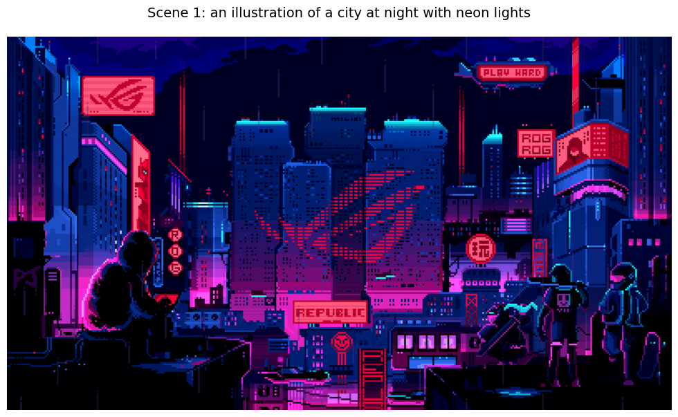
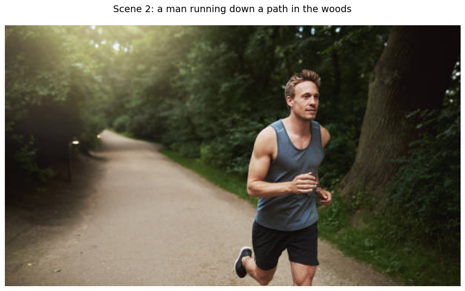
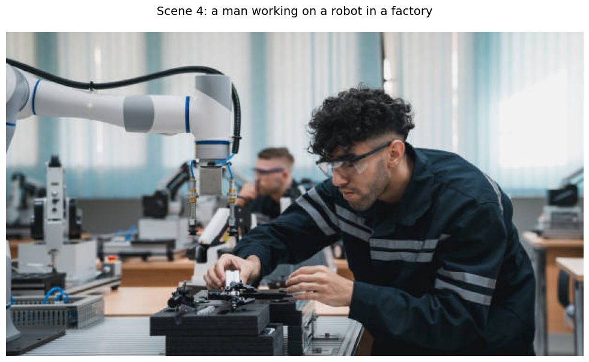
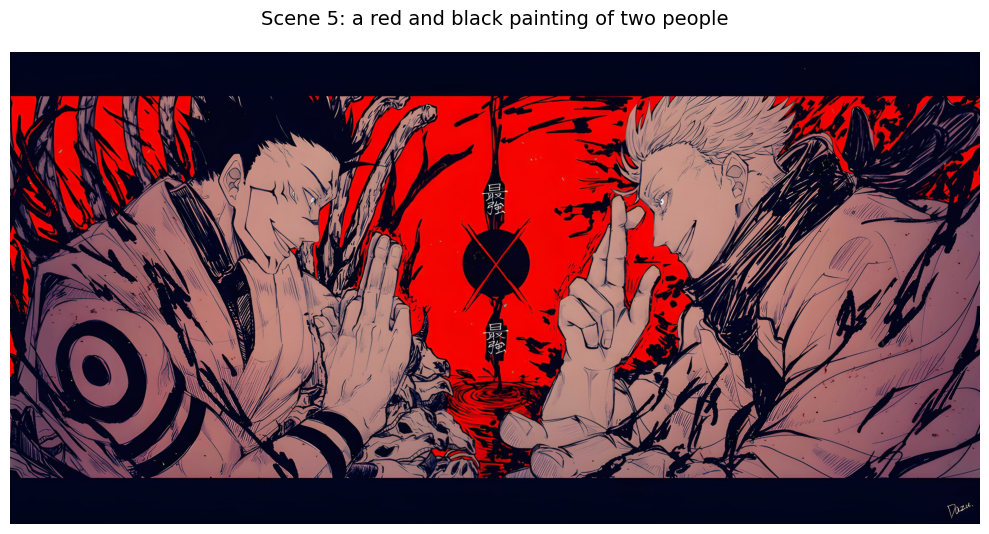
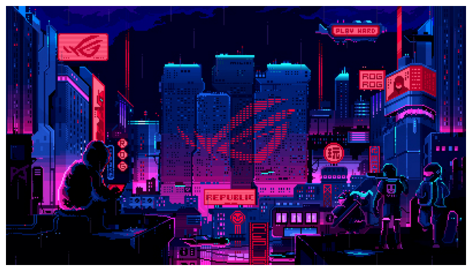
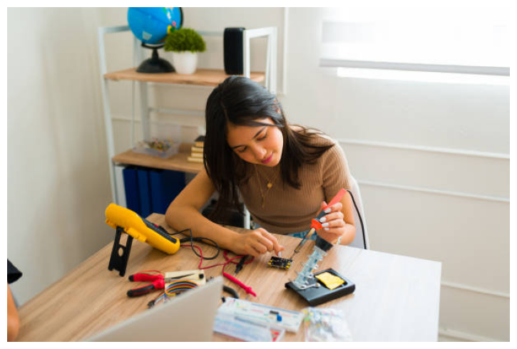
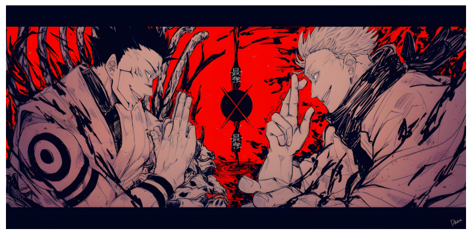

    ======================================================================
    UPLOAD IMAGES & GENERATE CAPTIONS
    ======================================================================

    📸 Please upload your images (recommended: 5-10 images)
       Tip: Choose images that tell a sequence or story!

</script>

    Saving 8-bit City_1920x1080.jpg to 8-bit City_1920x1080.jpg
    Saving istockphoto-488565460-612x612.jpg to istockphoto-488565460-612x612.jpg
    Saving istockphoto-1482634561-612x612.jpg to istockphoto-1482634561-612x612.jpg
    Saving istockphoto-1805432936-612x612.jpg to istockphoto-1805432936-612x612.jpg
    Saving wallpaperflare.com_wallpaper(2).jpg to wallpaperflare.com_wallpaper(2).jpg
    ✓ Loaded: 8-bit City_1920x1080.jpg
    ✓ Loaded: istockphoto-488565460-612x612.jpg
    ✓ Loaded: istockphoto-1482634561-612x612.jpg
    ✓ Loaded: istockphoto-1805432936-612x612.jpg
    ✓ Loaded: wallpaperflare.com_wallpaper(2).jpg

    ✅ Successfully loaded 5 images!

    🎯 Generating captions for your images...
       This may take a moment...

    Processing image 1/5... ✓ Done!
       Caption: 'an illustration of a city at night with neon lights'

    Processing image 2/5... ✓ Done!
       Caption: 'a man running down a path in the woods'

    Processing image 3/5... ✓ Done!
       Caption: 'a woman sitting at a desk working on a laptop'

    Processing image 4/5... ✓ Done!
       Caption: 'a man working on a robot in a factory'

    Processing image 5/5... ✓ Done!
       Caption: 'a red and black painting of two people'

    ✅ All captions generated!

    ======================================================================
    GENERATED CAPTIONS (IN ORDER)
    ======================================================================

    ======================================================================
    PART 2: REVIEW & EDIT CAPTIONS
    ======================================================================

    ✅ 5 scenes ready for story generation!

    Your Scene Captions:
    ----------------------------------------------------------------------
    Scene 1: an illustration of a city at night with neon lights
    Scene 2: a man running down a path in the woods
    Scene 3: a woman sitting at a desk working on a laptop
    Scene 4: a man working on a robot in a factory
    Scene 5: a red and black painting of two people
    ----------------------------------------------------------------------

    <strong>💡 Optional:</strong> Edit captions before generating the story!  
    Add a new cell below and modify captions like this: 
    <code>captions[0] = "A mysterious figure in the shadows"</code> 
    <code>captions[2] = "An intense moment of revelation"</code>

    ======================================================================
    PART 3: SELECT MOOD & GENERATE STORY
    ======================================================================

    <h3 style='color: #1976d2; margin-bottom: 15px;'>🎭 Choose Your Story Mood</h3>
    
Select one of the following moods for your story:

    <ul style='color: #424242; line-height: 2;'>
        <li><strong>romance</strong> - Tender, emotional, heartfelt love story 💕</li>
        <li><strong>comedy</strong> - Funny, lighthearted, humorous tale 😄</li>
        <li><strong>scary</strong> - Dark, suspenseful horror story 😱</li>
        <li><strong>action</strong> - Fast-paced, thrilling adventure 💥</li>
        <li><strong>cartoonish</strong> - Whimsical, playful animated-style story 🎨</li>
    </ul>

    📝 Enter your desired mood below:
       Options: romance, comedy, scary, action, cartoonish

    ✓ Selected mood: action

    ✨ Generating your action story from the captions...
       This may take 30-60 seconds...

    ✅ Story generation complete!

Inside a glass-walled office building, a woman sat hunched over her laptop, the screen glowing like a beacon in the dark. Her hands flew across the keyboard, her fingers dancing like a storm cloud on the wind. Every click and scroll sent shivers down her spine, her eyes focused solely on the digital battlefield she was constructing.

Meanwhile, in the heart of the industrial district, a masked man worked with a frenzy of precision. He moved like a phantom, his body a blur as he manipulated intricate robotic parts with an almost superhuman dexterity. His hands danced over the control panel, his eyes fixed on the robot's intricate movements.

In the flickering neon alley, a different scene unfolded. Two figures, shrouded in darkness, were locked in an intense dance of violence. One, wielding a rusty knife, was swift and precise, while the other, armed with a gleaming blade, was relentless and merciless. Their movements were a whirlwind of motion, their fists clashing in a symphony of bone-jarring impact.

As the night wore on, the city transformed into a nocturnal landscape. Neon lights illuminated the bustling streets, casting distorted reflections on the puddles and shattered windows. The air grew thick with a mix of pollution and the pungent scent of ozone, creating a sensory overload that intensified the thrill of each moment.

The night culminated in a breathtaking display of light and sound as the masked assassin unleashed a torrent of bullets from his hidden arsenal. The city responded in kind, the streets echoing with gunshots and explosions. Yet, amidst the chaos, the woman continued to work, her focus unwavering, her hands dancing across the keys.

<h2 style='color: #2c3e50; margin-top: 30px;'>🎬 Story Scenes</h2>

<h3 style='color: #3498db; margin-top: 25px;'>Scene 1</h3>

an illustration of a city at night with neon lights

<h3 style='color: #3498db; margin-top: 25px;'>Scene 2</h3>

a man running down a path in the woods

<h3 style='color: #3498db; margin-top: 25px;'>Scene 3</h3>

a woman sitting at a desk working on a laptop

<h3 style='color: #3498db; margin-top: 25px;'>Scene 4</h3>

a man working on a robot in a factory

<h3 style='color: #3498db; margin-top: 25px;'>Scene 5</h3>

a red and black painting of two people

    💾 Saving story to file...
    ✅ Story saved as 'generated_story.txt'

    📥 Download it from the Files panel on the left

    <h3 style='color: #155724; margin-bottom: 10px;'>🎉 Your Action Story is Ready!</h3>
    
Check the 'generated_story.txt' file in the Files panel →

    

        ✨ Want a different mood? Just run Cell 7 again and choose another!
    

    ======================================================================
    ✨ PROJECT COMPLETE!
    ======================================================================

    🎬 Your Action Storyboard is complete!
       Mood: Action
       Scenes: 5

    💡 TIP: Run Cell 7 again to generate the same story in a different mood!

    Thank you for using AI Storyboard Maker!
